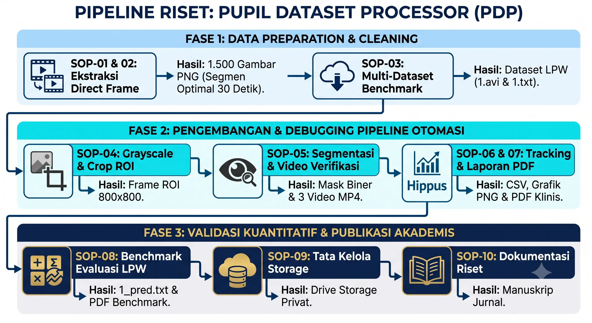

<p align="center">
  
</p>

<p align="center">
  <a href="https://colab.research.google.com/drive/1L1kNg5T-YRJfGFKLBbLjp5Z9J1r9pVnx" target="_blank"></a>&nbsp;<a href="#"></a>&nbsp;<a href="#"></a>&nbsp;<a href="#"></a>&nbsp;<a href="#"></a>
</p>

---

# **pupil-dataset-analysis**
## **Pengembangan Dataset Video Pupil dan Analisis Awal Dinamika Diameter Pupil Menggunakan Visi Komputer**

Repositori resmi ini memuat alur kerja otomasisasi komputasi, master notebook, dan dokumentasi **Hibah Penelitian** berfokus pada pengembangan dataset video pupil berakurasi tinggi serta analisis awal dinamika diameter pupil berbasis Visi Komputer (*Computer Vision*).

---

## **Diagram Pipeline Riset & Dokumentasi SOP**

<details>
<summary><b>Klik di sini untuk melihat Diagram Pipeline Riset (SOP-01 s/d SOP-09)</b></summary>
<br>
<p align="center">
  
</p>
</details>

### **Menu Dokumentasi Utama Riset:**
* **[FASE 1: Data Preparation & Cleaning (SOP-01 s/d SOP-03)](docs/about_program/fase1_data_preparation.md)**
* **[FASE 2: Pipeline Otomasi & Segmentasi (SOP-04 s/d SOP-06)](docs/about_program/fase2_pipeline_otomasi.md)**
* **[FASE 3: Validasi Benchmark & Penyelesaian (SOP-07 s/d SOP-09)](docs/about_program/fase3_validasi_benchmark.md)**
* **[TECHNICAL PAPER: Spesifikasi Metodologi & Algoritma Riset](docs/Technical_Paper_Pupil_Processor.md)**

---

## **Cakupan, Luaran, & Batasan Riset Hibah**

### **1. Cakupan Riset (Research Scope)**
Riset ini mencakup perancangan alur komputasi terstandarisasi (9 SOP dalam 3 Fase) untuk mengolah video mentah rekaman mata menjadi dataset digital terstruktur:
* **Ekstraksi Frame Lossless**: Mengonversi video rekaman mentah menjadi 1.500 bingkai PNG *Lossless* (30 Detik @ 50 FPS).
* **Stabilisasi ROI Mata**: Pemotongan otomatis area mata $800 \times 800\text{ px}$ berbasis penapis *Exponential Moving Average* (EMA).
* **Segmentasi Pupil Adaptif**: Segmentasi biner pupil menggunakan ambang batas adaptif ($T = V_{\text{min}} + 25$) dan penutupan pantulan *glint* LED.
* **Ekstraksi Dinamika Diameter**: Perhitungan diameter simetris isotropik ($D = 2\sqrt{\text{Area}/\pi}$), titik pusat $(X, Y)$, dan penapisan kedipan.

### **2. Luaran Utama Riset (Grant Deliverables)**
* **Master Notebook Colab**: [`Colab_Pupil_Dataset_Processor.ipynb`](https://colab.research.google.com/drive/1L1kNg5T-YRJfGFKLBbLjp5Z9J1r9pVnx) (Pipeline SOP-01 s/d SOP-06).
* **Dataset Terstruktur**: 
  - 1.500 Bingkai PNG *Lossless* (Segmen Optimal 30 Detik).
  - 1.500 Bingkai PNG ROI $800 \times 800\text{ px}$.
  - 1.500 Bingkai PNG Masker Biner Pupil (`1_Mask_Biner/`).
  - Berkas Tabular CSV Deret-Waktu (`[Nama_Responden]_laporan_analisis_sop06.csv`).
* **Media Verifikasi Visual**: Berkas Video Terpadu MP4 3-panel (Tracking + Masker Biner + Grafik Temporal Realtime).
* **Technical Paper Akademis**: Berkas spesifikasi teknis metodologi ([`Technical_Paper_Pupil_Processor.md`](docs/Technical_Paper_Pupil_Processor.md)).

### **3. Batasan Riset (Research Limitations)**
* **Tahap Eksplorasi Awal**: Riset ini difokuskan pada pembangunan dataset dan analisis awal dinamika pupil.
* **Tanpa Kesimpulan Klinis Akhir**: Penelitian ini **tidak mengambil kesimpulan diagnosa medis/klinis akhir**, melainkan menyediakan fondasi dataset dan pipeline yang teruji untuk riset klinis lanjutan.

---

## **Spesifikasi Hardware & Perangkat Akuisisi Dataset**

Akuisisi dataset video pupil resolusi tinggi dilakukan selama **6 Hari Sesi Perekaman (08 Juni 2026 – 14 Juni 2026)** menggunakan kombinasi perangkat optik & sinematografi profesional:

| Perangkat Hardware / Peralatan | Spesifikasi Teknis Optik & Sinematografi | Peran dalam Akuisisi Dataset |
| :--- | :--- | :--- |
| **Camera Sony A7 IV Mirrorless** | Full Frame 33MP, FF 4K30p / 1.5x Crop 4K60p 10-bit 4:2:2 | Perekaman video mentah resolusi tinggi dengan detail piksel mikro |
| **Sony FE 100mm F/2.8 Macro GM OSS** | Lensa Macro 1.4x (E-mount) khusus pemotretan *close-up* | Isolasi penampang iris dan pupil tanpa distorsi optik tepi |
| **Yongnuo YN-300 IV LED Video Light** | Portable RGB LED Light (3200K-5600K) | Penjagaan suhu kecerahan konstan untuk mengurangi variansi bayangan |
| **Light Stand Takara Spirit-3** | Stand Penyangga Lampu Statis | Penyangga sumber cahaya bebas guncangan saat perekaman berlangsung |

---

## **Petunjuk Penggunaan Master Notebook (Google Colab)**

Seluruh proses ekstraksi dataset dan analisis dinamika pupil dapat dijalankan secara terpadu melalui **Google Colab**:

1. Buka Master Notebook: **[`Colab_Pupil_Dataset_Processor.ipynb`](https://colab.research.google.com/drive/1L1kNg5T-YRJfGFKLBbLjp5Z9J1r9pVnx)**.
2. Hubungkan sesi dengan **Google Drive**.
3. Jalankan sel komputasi dari **SOP-01** hingga sel analisis akhir secara berurutan.

---

## **Struktur Luaran Dataset di Google Drive**

Setiap responden yang diproses akan menghasilkan struktur folder luaran berikut:

```text
Outputs/
 └── [Nama_Responden]/
      ├── 1_Raw_Frames_SOP01&02/       # 1.500 Bingkai PNG Lossless (Segmen Optimal 30 Detik)
      ├── 2_Grayscale_ROI_SOP03/       # Potongan Area Mata ROI 800x800 px Stabilized
      ├── 3_Mask_Pupil_SOP04/          # Folder 1_Mask_Biner PNG & Video Terpadu Realtime MP4
      └── 4_Hasil_Analisis_SOP05_06/   # Berkas Spreadsheet CSV & Laporan PDF Ringkas
```

---

## **Informasi Hibah Penelitian**

* **Judul Hibah**: *Pengembangan Dataset Video Pupil dan Analisis Awal Dinamika Diameter Pupil Menggunakan Visi Komputer*
* **Tahun Pelaksanaan**: 2026
* **Technical Paper**: [`docs/Technical_Paper_Pupil_Processor.md`](docs/Technical_Paper_Pupil_Processor.md)
* **Lisensi Repositori**: Akademis / Hibah Penelitian (Restricted Use)
