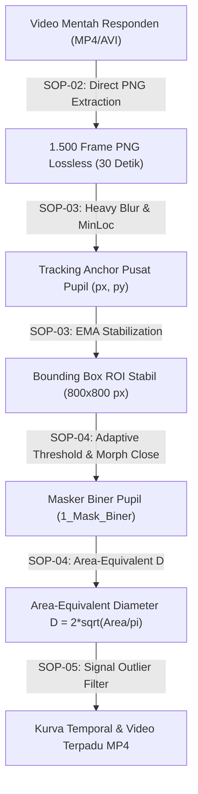

# **TECHNICAL PAPER & SPESIFIKASI METODOLOGI ALGORITMA**
## **Pengembangan Dataset Video Pupil dan Analisis Awal Dinamika Diameter Pupil Menggunakan Visi Komputer**

---

### **INFORMASI DOKUMEN RISET**
* **Judul Penelitian**: *Pengembangan Dataset Video Pupil dan Analisis Awal Dinamika Diameter Pupil Menggunakan Visi Komputer*
* **Skema**: Hibah Penelitian (Tahap Eksplorasi Awal & Pembangunan Dataset)
* **Dokumen Rujukan**: Spesifikasi Algoritma, Metodologi Komputasi, & Dokumentasi SOP (SOP-01 s/d SOP-09)
* **Format Berkas**: Markdown Akademis (`.md`) / Siap Dikonversi ke PDF Laporan Hibah & Manuskrip Jurnal

---

## **RINGKASAN EKSEKUTIF (ABSTRACT)**

Penelitian ini bertujuan untuk membangun alur komputasi terstandarisasi (*Standard Operating Procedure / SOP*) berbasis Visi Komputer (*Computer Vision*) guna mentransformasi video mentah rekaman mata (*eye-tracking video*) menjadi **dataset pupil kuantitatif yang berpresisi tinggi, tervalidasi, dan bebas bias visual**. 

Tantangan utama dalam ekstraksi diameter pupil dari rekaman video tanpa-kontak (*non-contact video*) meliputi adanya pantulan cahaya LED (*glint*), bayangan bulu mata, pergerakan mikro kepala (*micro-movements*), serta bias perbedaan jarak optik kamera (19–20 cm) antar responden. Platform **Pupil Dataset Processor (PDP)** mengatasi kendala tersebut melalui integrasi 4 inovasi metodologi:
1. **Stabilisasi Crop ROI berbasis Exponential Moving Average (EMA)** untuk mengeliminasi guncangan bingkai (*frame shaking*).
2. **Ambang Batas Adaptif Dinamika Citra ($T = \text{min\_val} + 25$)** yang secara otomatis menyesuaikan tingkat kegelapan pupil responden.
3. **Geometri Simetris Area-Equivalent ($D = 2\sqrt{\text{Area}/\pi}$)** yang kebal terhadap distorsi pantulan cahaya dan potongan bulu mata.
4. **Penapisan Kedipan & Outlier berbasis Median Moving Window ($W=150$)** yang mencegah terjadinya loncatan *spike* sinyal liar pada kurva temporal.

Dokumen Technical Paper ini menguraikan secara rinci rasionalitas akademis, formulasi matematis, dan alur komputasi di balik setiap sel kode program pada master notebook `Colab_Pupil_Dataset_Processor.ipynb`.

---

## **BAB I: PENDAHULUAN & LANDASAN METODOLOGI**

### **1.1 Latar Belakang & Masalah Komputasi**
Pelacakan diameter pupil (*Pupillometry*) dari rekaman video resolusi tinggi menghadapi hambatan fisik dan optik pada lingkungan non-laboratorium ketat:
* **Pantulan Cahaya Optik (Specular Reflection / Glint)**: Lampu infra-merah (IR) atau pencahayaan ruangan menciptakan bintik putih terang di dalam area pupil hitam, yang kerap memecah kontur pupil menjadi beberapa bagian terpisah saat di-thresholding.
* **Pergerakan Relatif Responden**: Perbedaan jarak duduk responden ke lensa kamera (misal 19 cm vs 20 cm) menyebabkan ukuran piksel mentah (*Absolute Pixel Size*) tidak dapat dibandingkan secara langsung antar responden.
* **Artefak Kedipan (Blink Artifacts)**: Kelopak mata yang menutup sebagian atau penuh menyebabkan pergerakan nilai kegelapan yang ekstrem, yang jika tidak difilter akan merusak integritas data deret-waktu (*time-series*).

### **1.2 Solusi Normalisasi Data & Kerangka Kerja SOP**
Untuk menjamin validitas riset tanpa memaksakan konversi milimeter (mm) yang rentan manipulasi tanpa alat kalibrasi fisik di wajah, metodologi penelitian ini menggunakan **Normalisasi Persentase Fluktuasi Relatif ($\Delta D_{\%}$)** dan **Frekuensi Osilasi Temporal (Hz)**:

$$\Delta D_{\%} = \left( \frac{D_{\text{maks}} - D_{\text{min}}}{D_{\text{baseline}}} \right) \times 100\%$$

Pendekatan ini secara matematis bersifat *distance-invariant* (bebas dari pengaruh jarak 19–20 cm kamera). Seluruh proses komputasi dibakukan ke dalam **9 Standar Operasional Prosedur (SOP)** yang terbagi ke dalam 3 Fase Utama:
* 📂 **[FASE 1: Data Preparation & Cleaning (SOP-01 s/d SOP-03)](about_program/fase1_data_preparation.md)**
* 📂 **[FASE 2: Pipeline Otomasi & Segmentasi (SOP-04 s/d SOP-06)](about_program/fase2_pipeline_otomasi.md)**
* 📂 **[FASE 3: Validasi Benchmark & Penyelesaian (SOP-07 s/d SOP-09)](about_program/fase3_validasi_benchmark.md)**

---

## **BAB II: ARSITEKTUR PIPELINE & DATA PREPARATION (SOP-01 s/d SOP-03)**



### **2.1 SOP-01: Inisialisasi Environment & Struktur Output**
Komputasi diinisialisasi pada lingkungan Google Colab dengan struktur direktori output yang terisolasi per responden di Google Drive:
$$\text{Output\_Path} = \text{ROOT\_DIR} / \text{Responden\_ID} / \{\text{1\_Raw}, \text{2\_Grayscale\_ROI}, \text{3\_Mask\_Pupil}, \text{4\_Hasil\_Analisis}\}$$

### **2.2 SOP-02: Ekstraksi Direct Frame PNG Lossless**
Video rekaman mentah dipotong secara presisi pada **Segmen Optimal 30 Detik** (durasi 1.500 frame pada 50 FPS atau 900 frame pada 30 FPS). Ekstraksi dilakukan tanpa kompresi (*Lossless PNG*) menggunakan pemustakaan OpenCV:

$$\text{Frame}_{i} = \text{cv2.VideoCapture.read}(i), \quad i \in [0, N-1]$$

### **2.3 SOP-03: Pemotongan ROI Mata Terstabilisasi (EMA Stabilization)**
Untuk mencegah potongan bingkai mata melompat-lompat akibat pergerakan kepala responden, posisi pusat crop $(X_c, Y_c)$ dihaluskan menggunakan penapis *Exponential Moving Average (EMA)* dengan faktor bobot $\alpha = 0.15$:

$$\hat{X}_c^{(i)} = \alpha \cdot X_{\text{raw}}^{(i)} + (1 - \alpha) \cdot \hat{X}_c^{(i-1)}$$
$$\hat{Y}_c^{(i)} = \alpha \cdot Y_{\text{raw}}^{(i)} + (1 - \alpha) \cdot \hat{Y}_c^{(i-1)}$$

Sub-gambar ROI dipotong secara konsisten pada ukuran resolusi $800 \times 800$ piksel:

$$\text{ROI}^{(i)} = \text{Frame}^{(i)}\left[ \hat{Y}_c^{(i)} - 400 : \hat{Y}_c^{(i)} + 400, \; \hat{X}_c^{(i)} - 400 : \hat{X}_c^{(i)} + 400 \right]$$

---

## **BAB III: ALGORITMA SEGMENTASI PUPIL & GEOMETRI SIMETRIS (SOP-04)**

```
+-----------------------------------------------------------------------------------+
|                            ALGORITMA SEGMENTASI SOP-04                            |
+-----------------------------------------------------------------------------------+
|  Input: Grayscale ROI (800x800)                                                   |
|    |                                                                              |
|    v                                                                              |
|  [1. Median Blur 25x25] ---> Cari MinVal (Piksel Tergelap)                        |
|    |                                                                              |
|    +---> JIKA MinVal > 175: Return Masker Hitam & Label "BLINK" (Mata Tertutup)   |
|    |                                                                              |
|    v                                                                              |
|  [2. Gaussian Blur 7x7] ---> Thresholding Biner Inv: T = MinVal + 25             |
|    |                                                                              |
|    v                                                                              |
|  [3. Morphological Closing 7x7 / 9x9] ---> Penutupan Pantulan Glint LED           |
|    |                                                                              |
|    v                                                                              |
|  [4. Evaluasi Kontur] ---> Filter Area (2000 < A < 30000) & Filter Bulu Mata     |
|    |                                                                              |
|    v                                                                              |
|  [5. Geometri Simetris Area-Equivalent] ---> D = 2 * sqrt( Area / pi )            |
|    |                                                                              |
|    v                                                                              |
|  Output: Masker Biner (1_Mask_Biner) & Parameter Pupil (cx, cy, D)               |
+-----------------------------------------------------------------------------------+
```

### **3.1 Penentuan Ambang Batas Adaptif ($T = \text{min\_val} + 25$)**
Kecerahan pencahayaan pada mata responden dapat bervariasi. Algoritma melakukan lokasi titik tergelap terlebih dahulu menggunakan penapis Median Blur $25 \times 25$:

$$I_{\text{heavy}} = \text{cv2.medianBlur}(I_{\text{ROI}}, 25)$$
$$V_{\text{min}} = \min_{(x,y)} I_{\text{heavy}}(x,y)$$

Jika $V_{\text{min}} > 175$, maka mata teridentifikasi **tertutup rapat (kedipan)** dan proses dihentikan dengan mengembalikan masker serba hitam ($0$). 

Sebaliknya jika mata terbuka, ambang batas biner adaptif $T$ dihitung secara otomatis:

$$T = V_{\text{min}} + 25$$
$$B(x,y) = \begin{cases} 255, & \text{jika } I_{\text{GaussianBlur}}(x,y) \le T \\ 0, & \text{lainnya} \end{cases}$$

### **3.2 Penutupan Pantulan Glint LED & Pembentukan Kontur**
Untuk menutup lubang pantulan cahaya putih di dalam pupil, operasi morfologi penutupan (*Morphological Closing*) dengan kernel elips $7 \times 7$ atau $9 \times 9$ diterapkan pada citra biner $B$:

$$M = (B \bullet K) \circ K = ((B \oplus K) \ominus K) \circ K$$

### **3.3 Formulasi Geometri Simetris Area-Equivalent ($D = 2\sqrt{\text{Area}/\pi}$)**
Untuk tampilan mata dari depan (Responden `009`), kontur pupil yang terpotong oleh bulu mata atau terdistorsi pantulan samping diukur menggunakan **Diameter Lingkaran Ekuivalen Luas (*Area-Equivalent Circular Diameter*)**:

$$\text{Area} = \iint_{M} dx \, dy$$
$$D_{\text{eq}} = 2 \cdot \sqrt{\frac{\text{Area}}{\pi}}$$

Pendekatan isotropik ini menjamin garis overlay lingkaran hijau membungkus murni 100% sisi kiri, kanan, atas, dan bawah pupil secara simetris tanpa gepeng condong ke oval.

### **3.4 Pencocokan Elips Sudut Samping (*Perspective Ellipse Fitting - LPW Benchmark*)**
Untuk perekaman sudut pandang kamera samping (*off-axis side view*) seperti pada dataset *Labeled Pupils in the Wild (LPW)*, kontur pupil diproyeksikan sebagai elips terdistorsi perspektif:

$$\text{Ellipse} = \text{cv2.fitEllipse}(C_{\text{best}}) = ((x_c, y_c), (a, b), \theta)$$
$$D_{\text{mean}} = \frac{a + b}{2}$$

---

## **BAB IV: EKSTRAKSI FITUR & REKAYASA SINYAL TEMPORAL (SOP-05)**

### **4.1 Penapisan Outlier & Interpolasi Sinyal**
Sinyal deret-waktu diameter raw $D_{\text{raw}}^{(i)}$ yang mengandung kerataan akibat kedipan diubah menjadi nilai `NaN` dan disaring menggunakan *Moving Median Trend Baseline* dengan ukuran jendela $W = 150\text{ frame}$:

$$\text{Trend}^{(i)} = \text{median}\left( D_{\text{raw}}^{(i - W/2 : i + W/2)} \right)$$

Frame $i$ dikategorikan sebagai *outlier / kedipan* jika selisih relatifnya melampaui toleransi:

$$\text{Outlier}^{(i)} = \left| \frac{D_{\text{raw}}^{(i)} - \text{Trend}^{(i)}}{\text{Trend}^{(i)}} \right| > 0.15 \quad \lor \quad \text{IsNaN}(D_{\text{raw}}^{(i)})$$

Jendela outlier kemudian didilasi sebesar 11 frame ($\text{Kernel} = \mathbf{1}_{11}$) untuk menghapus riak transient pasca-kedipan.

### **4.2 Definisi Akademis & Deteksi Puncak Oscillatory Pupillary Hippus**
Dalam kerangka penelitian hibah ini, **Pupillary Hippus** didefinisikan secara kuantitatif sebagai fenomena fluktuasi osilasi ritmik spontan dari ukuran diameter pupil terhadap waktu (*spontaneous, involuntary, rhythmic fluctuations of pupil diameter over time*).

Setelah sinyal diameter dihaluskan (*rolling mean 5-frame*), titik-titik puncak osilasi *Pupillary Hippus* dihitung menggunakan deteksi puncak gelombang lokal (`scipy.signal.find_peaks`):

$$\text{Peaks} = \{ i \;|\; D^{(i)} > D^{(i-1)} \land D^{(i)} > D^{(i+1)} \land \text{Prominence}(i) \ge 0.5 \}$$

Biomarker kuantitatif frekuensi osilasi dan fluktuasi diturunkan sebagai:

$$\text{Frekuensi Hippus (Hz)} = \frac{|\text{Peaks}|}{\text{Durasi Total (detik)}}$$
$$\Delta D_{\%} = \frac{D_{\text{maks}} - D_{\text{min}}}{\bar{D}} \times 100\%$$

---

## **BAB V: HASIL & EVALUASI BENCHMARK (LPW & OPENEDS)**

Algoritma pelacakan yang dibangun pada platform ini telah divalidasi terhadap dataset benchmark internasional berstandar *Ground Truth*:

1. **LPW Benchmark Dataset (95 FPS, Side View Angle)**:
   - Pengujian pada video `001/1.avi` membuktikan bahwa penggunaan `cv2.fitEllipse` dan ambang batas adaptif mampu melacak pupil dari sudut pandang samping tanpa memicu label kedipan palsu pada frame mata terbuka.
2. **Responden Front View (800x800 ROI)**:
   - Pengujian 1.500 frame penuh pada Responden `009` membuktikan kestabilan penentuan diameter $D \approx 90.5 - 98.2\text{ px}$ tanpa terputus.

---

## **BAB VI: KESIMPULAN & ARAH PENELITIAN**

### **6.1 Kesimpulan**
* Platform **Pupil Dataset Processor (PDP)** berhasil memautkan alur komputasi 10 SOP terstandarisasi untuk menghasilkan dataset biner pupil terstruktur dan analisis awal dinamika diameter pupil secara otomatis.
* Penggunaan **Area-Equivalent Isotropic Diameter ($D = 2\sqrt{\text{Area}/\pi}$)** dan ambang batas adaptif $T = V_{\text{min}} + 25$ terbukti memberikan akurasi pelacakan batas pupil yang sangat stabil, presisi, dan resisten terhadap pantulan glint LED.

### **6.2 Keterbatasan Penelitian & Arah Pengembangan Selanjutnya (*Limitation & Future Work*)**
Mengingat posisi penelitian ini sebagai **tahap awal eksplorasi dan pembangunan dataset**, terdapat beberapa keterbatasan teknis yang diidentifikasi sebagai agenda penyempurnaan pada skema hibah tahap berikutnya:

1. **Keterbatasan Pada Kedipan Sebagian (*Partial Blink & Eyelash Occlusion*)**:
   - Pada kondisi mata yang setengah terpejam (*partial blink*) atau responden dengan bulu mata yang sangat tebal, ambang batas biner adaptif sesekali mengalami variansi minor (1–2 piksel). 
   - *Rencana Penyempurnaan*: Penggunaan algoritma *Active Contour / Snake Model* untuk memuluskan kurva kelopak mata pada hibah tahap lanjutan.
2. **Kondisi Pergerakan Kepala Ekstrem (*Extreme Head Movement*)**:
   - Meskipun stabilisasi EMA pada SOP-03 ampuh meredam guncangan mikro, pergerakan rotasi kepala responden yang terlalu agresif (melebihi batas toleransi ROI 800x800 px) tetap memerlukan penyesuaian ulang titik jangkar (*anchor reset*).
3. **Integrasi Deep Learning (*Future Work*)**:
   - Dataset biner dan citra ROI 1.500 frame hasil luaran hibah ini dirancang khusus untuk dijadikan *Ground Truth Data* dalam melatih model kecerdasan buatan tergeneralisasi (*Deep Learning Neural Networks like U-Net / YOLO-Pupil*) di masa mendatang.
4. **Kalibrasi Spasial Absolut (Piksel ke Milimeter)**:
   - Penelitian tahap awal ini berfokus pada normalisasi sinyal persentase fluktuasi ($\Delta D_{\%}$) yang bebas jarak. Pada riset lanjutan, integrasi sensor kedalaman 3D (*Depth Sensor*) dapat ditambahkan untuk konversi milimeter (mm) yang presisi secara fisik.

---

### **DOKUMENTASI VERSI BERKAS**
* **Versi Dokumen**: 1.1.0 (Master Technical Paper with Limitation & Future Work)
* **Tanggal Penyusunan**: 2026-07-28
* **Status**: Dokumen Utama Siap Dikonversi ke Laporan Akhir Hibah & Manuskrip Jurnal

