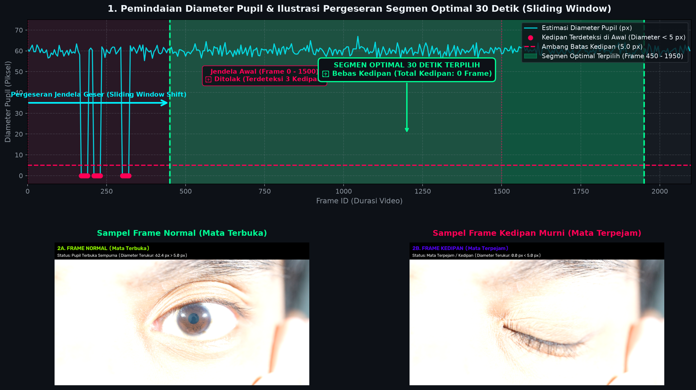
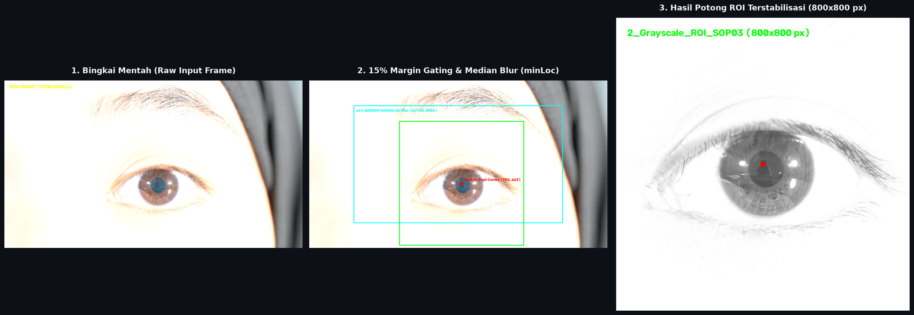

# **FASE 1: DATA PREPARATION & CLEANING**
## **Dokumentasi Standar Operasional Prosedur (SOP-01, SOP-02, SOP-03)**

---

### **1. RINGKASAN FASE 1**
Fase 1 berfokus pada tahap penyiapan data awal dari video mentah original hingga menjadi kepingan gambar *PNG Lossless* yang terisolasi pada jendela **Segmen Optimal 30 Detik** (1.500 Bingkai @ 50 FPS), serta pra-pemrosesan pemotongan area mata (*Region of Interest / ROI*) 800x800 piksel yang terstabilisasi tanpa distorsi pergerakan kepala.

---

### **2. DETAIL STANDAR OPERASIONAL PROSEDUR (SOP)**

#### **SOP-01: Inisialisasi Environment & Konfigurasi Workspace**
* **Tujuan**: Membangun lingkungan komputasi yang terisolasi di Google Colab dan memetakan struktur direktori output di Google Drive.
* **Logika Kerja**:
  1. **Penyambungan Google Drive**: Sistem melakukan *mounting* otomatis ke direktori Google Drive (`/content/drive`).
  2. **Pemindaian Berkas & Antarmuka Interaktif**: Memindai folder utama riset untuk mendeteksi berkas video mentah (`.mp4`, `.avi`, `.mkv`) dan menyediakan menu *Dropdown* interaktif untuk memilih responden.
  3. **Inisialisasi Folder Output**: Membangun 4 subfolder output standar per responden secara otomatis:
     - `1_Raw_Frames_SOP01&02/` : Tempat penyimpanan bingkai mentah gambar PNG.
     - `2_Grayscale_ROI_SOP03/` : Tempat penyimpanan hasil potong area mata 800x800 piksel terstabilisasi.
     - `3_Mask_Pupil_SOP04/` : Tempat penyimpanan masker biner pupil dan visualisasi *overlay*.
     - `4_Hasil_Analisis_SOP05_06/` : Tempat penyimpanan laporan deret-waktu CSV dan grafik visualisasi.

#### **SOP-02: Ekstraksi Direct Frame PNG Lossless (Segmen Optimal 30 Detik)**
* **Tujuan**: Mengisolasi durasi 30 detik terbaik (jendela waktu dengan kedipan paling minimal) dan mengekstraknya menjadi 1.500 bingkai PNG murni tanpa kompresi visual.
* **Logika Kerja**:
  1. **Pemindaian Kedipan Cepat**: Sistem memeriksa sampel bingkai secara berkala (setiap 5 frame) menggunakan ambang batas warna cepat pada area pupil. Jika ukuran titik pupil terdeteksi sangat kecil (kurang dari 5 piksel), bingkai tersebut ditandai sebagai kedipan.
  2. **Seleksi Jendela Waktu Optimal**: Memindai seluruh durasi video menggunakan jendela geser (*sliding window*) berdurasi 30 detik (1.500 frame). Sistem secara otomatis memilih rentang waktu dengan jumlah kedipan paling sedikit.
  3. **Ekstraksi Frame Murni**: Memotong 1.500 frame tepat pada rentang waktu terpilih dan menyimpannya secara *lossless* (`.png`) langsung ke folder `1_Raw_Frames_SOP01&02/`.

#### **Visualisasi Alur Kerja SOP-02**

*Gambar 1: Visualisasi alur kerja SOP-02. Panel atas menampilkan pemindaian diameter pupil (px), ambang kedipan (5.0 px), serta ilustrasi pergeseran jendela geser (Sliding Window Shift) dari segmen berkedip (Frame 0-1500, Ditolak) menuju Segmen Optimal 30 Detik (Frame 450-1950, Terpilih); Panel bawah menampilkan perbandingan sampel Frame Normal (Mata Terbuka - open.png) vs Frame Kedipan Murni (Mata Terpejam - blink.png).*

#### **SOP-03: Pra-Pemrosesan Grayscale & EMA Motion-Stabilized Crop ROI (800x800 px)**
* **Tujuan**: Pemotongan area mata (*Region of Interest / ROI*) resolusi 800x800 piksel yang terstabilisasi secara halus tanpa guncangan akibat pergerakan kepala responden.
* **Logika Kerja**:
  1. **Eliminasi Tepi Frame (15% Margin Gating)**: Mengabaikan 15% area terluar dari tepi gambar untuk mencegah gangguan warna gelap dari hijab, rambut, pakaian, atau bayangan luar yang dapat mengacaukan pencarian lokasi pupil.
  2. **Penapisan Kelabu & Deteksi Titik Tergelap**: Mengonversi bingkai ke skala kelabu (*grayscale*) dan menerapkan penapis *Median Blur* (ukuran 25x25) untuk menghaluskan tekstur mata, kemudian mencari koordinat piksel tergelap sebagai estimasi posisi pusat pupil.
  3. **Penstabil Pergerakan (EMA Motion Stabilization)**: Menghaluskan pergerakan titik pusat pemotongan menggunakan metode *Exponential Moving Average* (EMA dengan bobot peredaman 8%). Metode ini menjaga agar kotak pemotongan tidak berguncang (*shaking*) saat mata bergerak cepat atau kepala bergeser sedikit.
  4. **Pemotongan ROI & Penanganan Batas Gambar**: Memotong gambar area mata berukuran 800x800 piksel tepat di sekeliling titik pusat terstabilisasi. Jika kotak pemotongan menyentuh tepi luar gambar, sistem otomatis menambahkan bantalan tepi (*border padding*) agar ukuran gambar hasil potong tetap tepat 800x800 piksel. Gambar hasil potong disimpan ke folder `2_Grayscale_ROI_SOP03/`.

#### **Visualisasi Alur Kerja SOP-03**

*Gambar 2: Visualisasi 3-panel alur kerja SOP-03. Panel 1 menampilkan Bingkai Mentah Original; Panel 2 menampilkan area aktif 15% Border Margin Gating & titik tergelap pupil (silang merah); Panel 3 menampilkan hasil potong ROI 800x800 piksel terstabilisasi.*

