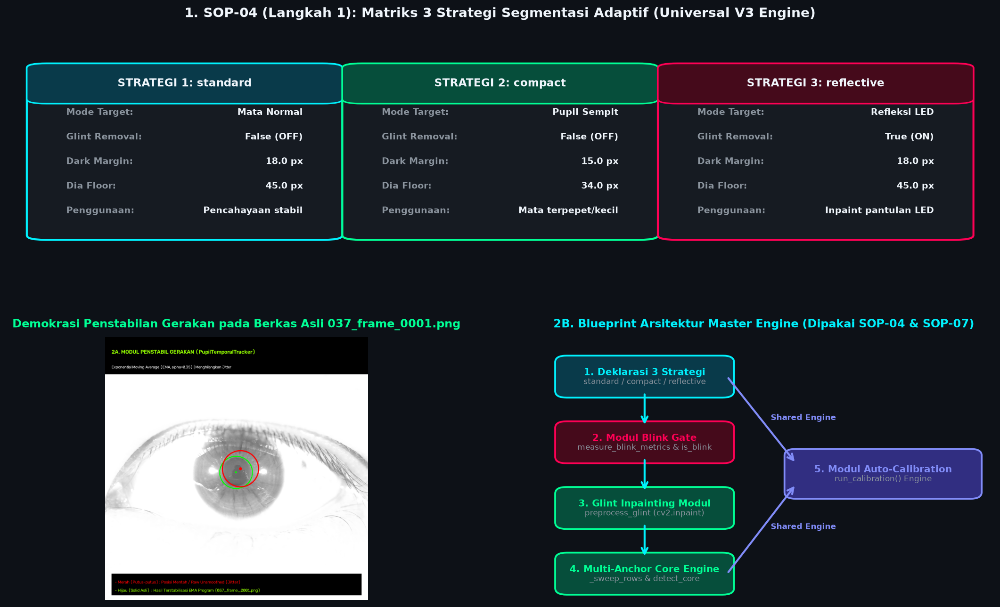
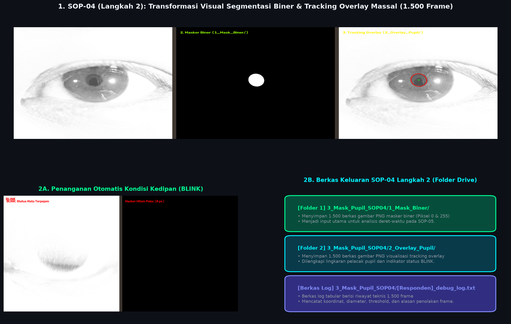
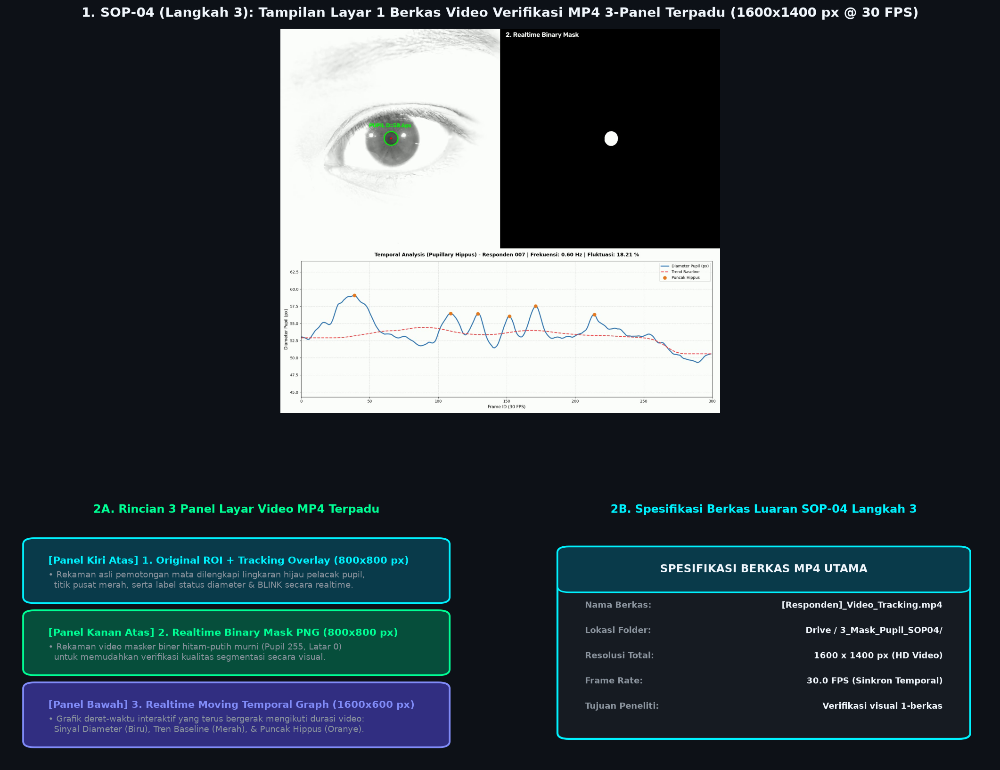

# **FASE 2: PIPELINE OTOMASI & SEGMENTASI**
## **Dokumentasi Standar Operasional Prosedur (SOP-04, SOP-05, SOP-06)**

---

### **1. RINGKASAN FASE 2**
Fase 2 merupakan inti dari platform komputasi **Pupil Dataset Processor (PDP)**. Pada tahap ini, sistem melakukan segmentasi area pupil secara otomatis dan berpresisi tinggi dari gambar pemotongan area mata (ROI), mengisolasi bentuk pupil menjadi masker hitam-putih (masker biner), merekayasa deret data osilasi gerak pupil (*Pupillary Hippus*), serta menghasilkan luaran berupa video verifikasi terpadu dan laporan PDF diagnostik klinis resmi.

---

### **2. DETAIL STANDAR OPERASIONAL PROSEDUR (SOP)**

#### **SOP-04: Segmentasi Masker Biner Pupil & Render Video Terpadu MP4**
SOP-04 dipecah menjadi **3 langkah utama** untuk memastikan proses pencarian pupil berjalan stabil di berbagai kondisi pencahayaan dan gerakan responden:

* **SOP-04 (Langkah 1): Inisialisasi Universal V3 Engine & Strategi Adaptif**
  - **Tujuan**: Menyiapkan mesin pelacak pupil utama (Universal V3 Engine) dan mengalokasikan strategi pencahayaan yang fleksibel untuk menghadapi berbagai karakter mata responden.
  - **Logika Kerja**:
    1. **Pengaturan Strategi Pencahayaan**: Menyiapkan 3 mode deteksi adaptif (`standard`, `compact`, `reflective`) untuk menangani berbagai tingkat pencahayaan dan pantulan sinar LED pada kornea.
    2. **Deklarasi Penstabil Gerakan (PupilTemporalTracker)**: Menyiapkan algoritma *Exponential Moving Average (EMA)* untuk meredam guncangan (*jitter*) pergerakan koordinat pusat dan diameter pupil.
    3. **Modul Auto-Calibration Engine**: Menyediakan logika pengujian 60 frame sampel untuk memilih strategi terbaik dan mengukur rata-rata ukuran pupil normal (*baseline diameter*).

#### **Visualisasi Arsitektur SOP-04 (Langkah 1)**

*Gambar 1: Blueprint Arsitektur Universal V3 Engine (SOP-04 Langkah 1). Panel atas menampilkan Matriks 3 Strategi Segmentasi Adaptif (standard, compact, reflective); Panel bawah kiri menampilkan demonstrasi kerja Modul Penstabil Gerakan (PupilTemporalTracker berbasis EMA) pada berkas overlay asli 037_frame_0001.png; Panel bawah kanan menampilkan diagram alur arsitektur modular engine yang digunakan bersama oleh SOP-04 dan SOP-07 (LPW Benchmark Validation).*

* **SOP-04 (Langkah 2): Pemrosesan Masker Biner PNG & Visualisasi Overlay**
  - **Tujuan**: Memproses seluruh 1.500 bingkai mata (ROI 800x800 px), mendeteksi kedipan, dan memisahkan piksel pupil murni dari latar belakang mata.
  - **Logika Kerja**:
    1. **Pemeriksaan Deteksi Kedipan**: Jika mata responden terpejam atau gelap total, sistem secara otomatis menandai bingkai tersebut sebagai *"BLINK"* dan menghasilkan gambar hitam polos tanpa memicu error.
    2. **Pemisahan Warna Pupil Adaptif**: Mengisolasi lingkaran pupil secara dinamis berdasarkan ambang kegelapan tergelap di area mata, sehingga bentuk pupil dapat terpisah sempurna dari iris dan kornea.
    3. **Pembersihan Pantulan Cahaya (Glint Removal)**: Menghapus titik kilatan cahaya putih (pantulan lampu ruangan/LED) yang menempel di tengah pupil agar bentuk pupil kembali bundar sempurna.
    4. **Pengukuran Diameter Geometri Lingkaran**: Mengukur diameter pupil berdasarkan total luas area hitam terdeteksi. Metode ini sangat stabil dan kebal terhadap rintangan seperti bayangan bulu mata atau kelopak mata yang menutupi sebagian pupil.
    5. **Penyimpanan Hasil**:
       - Subfolder `1_Mask_Biner/` : Menyimpan 1.500 gambar masker biner hitam-putih murni.
       - Subfolder `2_Overlay_Tracking/` : Menyimpan 1.500 gambar visualisasi dengan lingkaran hijau pelacak pupil dan titik pusat merah.
       - Berkas `debug_sop04_calibration.log` : Menyimpan catatan rekaman data teknis per bingkai untuk verifikasi kualitas.

#### **Visualisasi Alur Kerja SOP-04 (Langkah 2)**

*Gambar 2: Visualisasi Alur Kerja SOP-04 Langkah 2. Panel atas menampilkan transformasi visual dari Grayscale ROI Input (800x800 px) menjadi Masker Biner PNG (1_Mask_Biner/) dan Tracking Overlay (2_Overlay_Pupil/); Panel bawah kiri menampilkan penanganan otomatis kondisi kedipan (BLINK) yang menghasilkan masker hitam polos (0 px); Panel bawah kanan menampilkan struktur berkas keluaran SOP-04 Langkah 2 pada Google Drive.*

* **SOP-04 (Langkah 3): Render Berkas 1 Video Verifikasi Terpadu MP4**
  - **Tujuan**: Menggabungkan seluruh hasil visualisasi ke dalam 1 berkas video MP4 interaktif untuk mempermudah verifikasi visual oleh peneliti.
  - **Logika Kerja**:
    1. **Penggabungan Tampilan 3-Panel**: Merender video MP4 resolusi tinggi ($1600 \times 1400\text{ px}$ @ 30 FPS) yang menggabungkan 3 tampilan sekaligus dalam satu layar:
       - **Panel Kiri Atas**: Rekaman asli pemotongan mata lengkap dengan lingkaran hijau pelacak pupil dan status kedipan.
       - **Panel Kanan Atas**: Tampilan masker biner hitam-putih secara *realtime*.
       - **Panel Bawah**: Grafik gerak diameter pupil secara *realtime* lengkap dengan garis tren rata-rata dan penanda puncak osilasi *hippus*.
    2. **Penyimpanan Berkas**: Disimpan langsung ke folder `3_Mask_Pupil_SOP04/[Nama_Responden]_Video_Tracking_dan_Grafik_Realtime.mp4`.

#### **Visualisasi Berkas Video SOP-04 (Langkah 3)**

*Gambar 3: Visualisasi Berkas Video SOP-04 Langkah 3. Panel atas menampilkan bingkai asli dari video MP4 terpadu 3-panel (1600x1400 px @ 30 FPS) yang diekstrak langsung dari 007_Video_Tracking_dan_Grafik_Realtime.mp4; Panel bawah kiri menampilkan rincian elemen 3 panel layar; Panel bawah kanan menampilkan spesifikasi berkas video luaran resmi SOP-04 Langkah 3.*

#### **SOP-05: Tracking Pupil, Filter Outlier Moving Median, & Sinyal Temporal Hippus**
* **Tujuan**: Menganalisis deret data waktu (*time-series*) diameter pupil, membersihkan gangguan lonjakan data akibat kedipan, dan menghitung indikator osilasi gerakan pupil (*Hippus*).
* **Logika Kerja**:
  1. **Pembersihan Sinyal & Kedipan**:
     - Menghapus titik data kedipan yang hilang dan menyambungkannya secara halus (*Failsafe Linear Interpolation*).
     - Menerapkan penapis rata-rata bergerak (*Moving Median Filter*) untuk mengambil garis tren utama gerakan pupil tanpa terpengaruh lonjakan tiba-tiba.
     - Mengeliminasi loncatan data ekstrem saat mata mulai berkedip atau baru terbuka kembali agar sinyal tetap bersih.
  2. **Perhitungan Indikator Klinis Osilasi Hippus**:
     - **Frekuensi Osilasi (Hz)**: Menghitung berapa kali pupil mengembang dan mengecil (jumlah gelombang) dalam setiap detiknya.
     - **Persentase Fluktuasi Amplitudo (%)**: Menghitung seberapa jauh rentang perubahan ukuran pupil dibandingkan dengan ukuran rata-rata baseline-nya.
  3. **Ekspor Data Tabular & Grafik PNG**:
     - Menyimpan berkas spreadsheet CSV (`[Nama_Responden]_laporan_analisis_sop06.csv`) di folder `4_Hasil_Analisis_SOP05_06/`.
     - Menyimpan gambar grafik analisis osilasi (`[Nama_Responden]_chart_hippus_sop06.png`).

#### **SOP-06: Generator Laporan PDF Diagnostik Klinis Individual**
* **Tujuan**: Menghasilkan dokumen cetak laporan medis diagnostik klinis resmi dalam format PDF yang rapi per responden secara otomatis.
* **Logika Kerja**:
  1. **Sistem Proteksi Otomatis**: Memastikan pustaka pembuat PDF (ReportLab) siap digunakan secara otomatis tanpa risiko program berhenti (*Anti-Crash Failsafe*).
  2. **Kompilasi Tabel Metrik Medis**: Menyusun seluruh parameter hasil analisis (Rata-rata Diameter Baseline, Frekuensi Osilasi Hippus, Fluktuasi Amplitudo, dan Tingkat Kedipan) ke dalam tabel ringkasan yang mudah dibaca.
  3. **Penggabungan Grafik & Ekspor Berkas**: Menyematkan gambar grafik osilasi pupil ke dalam dokumen dan menerbitkan berkas resmi `[Nama_Responden]_Laporan_Klinis_SOP06.pdf` di folder `4_Hasil_Analisis_SOP05_06/`.
