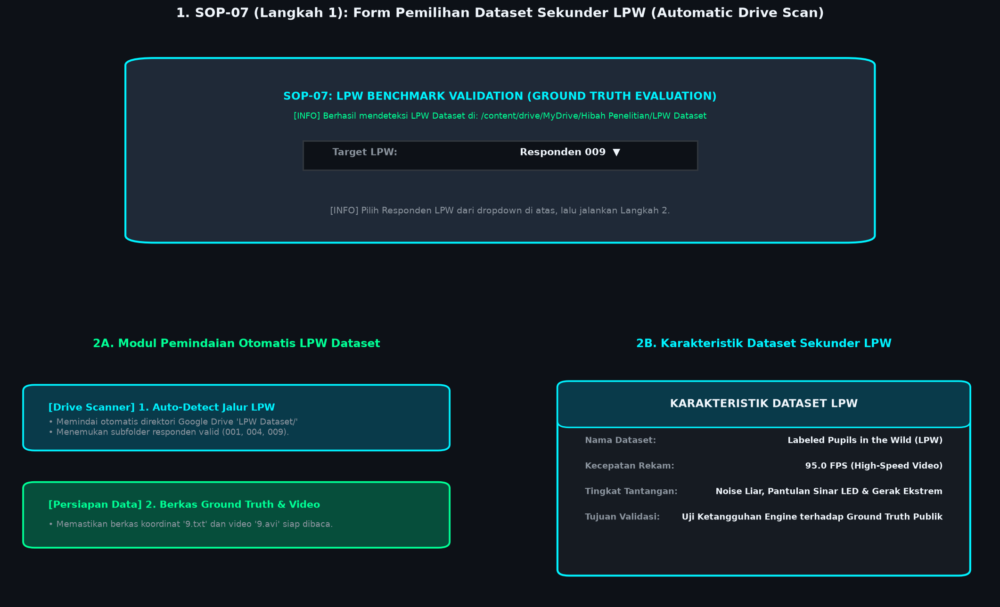
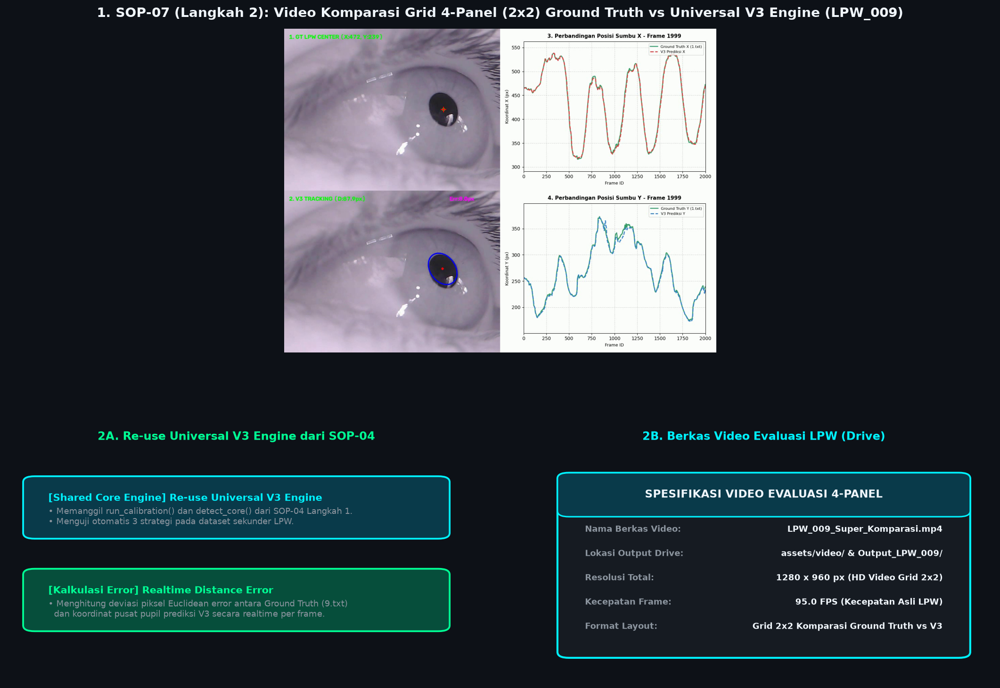
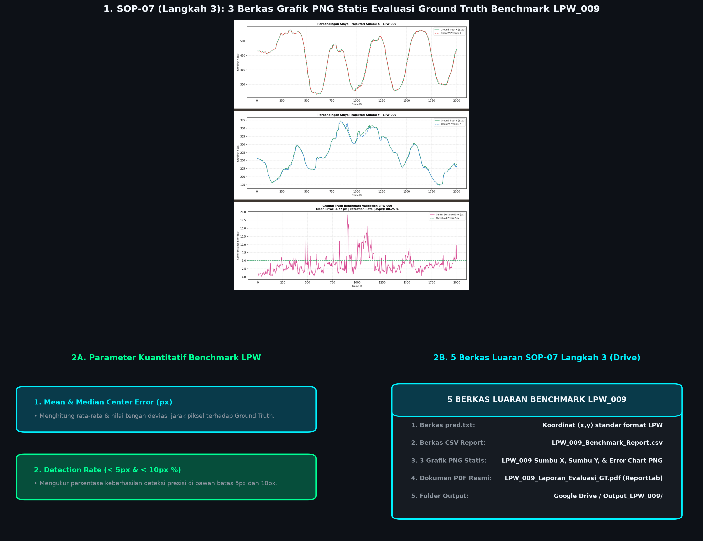

# **FASE 3: VALIDASI BENCHMARK & PENYELESAIAN RISET**
## **Dokumentasi Standar Operasional Prosedur (SOP-07, SOP-08, SOP-09)**

---

### **1. RINGKASAN FASE 3**
Fase 3 berfokus pada tahap validasi kuantitatif mutlak (*cross-validation*) untuk mengukur seberapa akurat algoritma OpenCV kita jika disandingkan dengan label *Ground Truth* publik berstandar internasional (*Labeled Pupils in the Wild* / LPW Dataset), serta pengarsipan data dan finalisasi publikasi riset.

---

### **2. DETAIL STANDAR OPERASIONAL PROSEDUR (SOP)**

#### **SOP-07: Validasi Benchmark Ground Truth LPW (Pengujian Dataset Sekunder)**
SOP-07 dipecah menjadi **3 langkah utama** untuk memastikan pengujian algoritma terhadap dataset sekunder LPW berjalan sistematis, transparan, dan terukur secara empiris:

* **SOP-07 (Langkah 1): Form Pemilihan Dataset LPW & Pemindaian Otomatis Drive**
  - **Tujuan**: Memindai direktori penyimpanan dataset sekunder LPW di Google Drive dan menyediakan antarmuka interaktif untuk memilih target responden.
  - **Logika Kerja**:
    1. **Pemindaian Otomatis Drive**: Sistem memindai lokasi folder `LPW Dataset/` di Google Drive dan secara otomatis mendeteksi subfolder responden valid (misal `001`, `004`, `009`).
    2. **Antarmuka Dropdown Interaktif**: Menampilkan *Form Dropdown* interaktif (`widgets.Dropdown`) di Google Colab agar pengguna dapat memilih ID responden LPW yang ingin dievaluasi.
    3. **Deteksi Berkas Kunci Jawaban**: Memverifikasi keberadaan berkas Ground Truth `[ID].txt` dan video sumber `[ID].avi`.

#### **Visualisasi SOP-07 (Langkah 1)**

*Gambar 1: Visualisasi SOP-07 Langkah 1. Panel atas menampilkan Antarmuka Form Dropdown Pemilihan Target Responden LPW (001, 004, 009); Panel bawah kiri menampilkan modul pemindaian otomatis direktori Google Drive; Panel bawah kanan menampilkan karakteristik dataset sekunder LPW.*

* **SOP-07 (Langkah 2): Re-use Universal V3 Engine & Render Video Grid 4-Panel (2x2)**
  - **Tujuan**: Memproses video LPW yang sarat *noise*, kilatan cahaya liar, dan pergerakan mata ekstrem menggunakan mesin pelacak utama (Universal V3 Engine) serta merender video komparasi 4-panel.
  - **Logika Kerja**:
    1. **Re-use Universal V3 Engine**: Memanggil fungsi `run_calibration()` dan `detect_core()` yang dibangun di SOP-04 Langkah 1 tanpa mengubah arsitektur dasar engine.
    2. **Parsing Ground Truth**: Membaca koordinat pusat pupil asli `(GT_X, GT_Y)` dari berkas `[ID].txt`.
    3. **Render Video Komparasi 4-Panel (2x2)**: Merender berkas video MP4 resolusi tinggi ($1280 \times 960\text{ px}$ @ 95 FPS) yang menampilkan 4 tampilan sejajar secara realtime:
       - **Panel Kiri Atas (1)**: *Ground Truth LPW Center* (Penanda silang merah & titik hijau dari `[ID].txt`).
       - **Panel Kiri Bawah (2)**: *Universal V3 Engine Tracking* (Lingkaran biru pelacak pupil & titik merah pusat + Nilai Distance Error px).
       - **Panel Kanan Atas (3)**: Grafik Perbandingan Trajektori Realtime Sumbu X (Ground Truth vs Prediksi V3).
       - **Panel Kanan Bawah (4)**: Grafik Perbandingan Trajektori Realtime Sumbu Y (Ground Truth vs Prediksi V3).
    4. **Penyimpanan Berkas Video**: Disimpan di folder `Output_LPW_[ID]/LPW_[ID]_Video_Evaluasi_4Panel.mp4` (atau `LPW_009_Super_Komparasi.mp4`).

#### **Visualisasi Video Evaluasi SOP-07 (Langkah 2)**

*Gambar 2: Visualisasi Video Evaluasi SOP-07 Langkah 2. Panel atas menampilkan bingkai asli dari video MP4 komparasi 4-panel (1280x960 px @ 95 FPS) yang diekstrak langsung dari LPW_009_Super_Komparasi.mp4; Panel bawah kiri menampilkan rincian Re-use Universal V3 Engine dari SOP-04; Panel bawah kanan menampilkan spesifikasi berkas video evaluasi 4-panel.*

* **SOP-07 (Langkah 3): Ekspor `pred.txt`, 3 Grafik PNG Statis, CSV, & PDF ReportLab**
  - **Tujuan**: Menghitung metrik deviasi error kuantitatif dan menerbitkan 5 berkas luaran resmi untuk pembuktian ilmiah.
  - **Logika Kerja**:
    1. **Kalkulasi Metrik Error Kuantitatif**:
       - **Mean Center Error (px)**: Rata-rata deviasi jarak Euclidean antara koordinat prediksi V3 dan Ground Truth.
       - **Median Center Error (px)**: Nilai tengah deviasi kesalahan pelacakan.
       - **Detection Rate (< 5px & < 10px %)**: Persentase frame yang berhasil dilacak dengan tingkat kesalahan di bawah 5 piksel dan 10 piksel.
    2. **Ekspor 5 Berkas Luaran Evaluasi**:
       - Berkas **`pred.txt`**: Teks koordinat `(x, y)` hasil prediksi format standar benchmark LPW.
       - Berkas **`LPW_[ID]_Benchmark_Report.csv`**: Spreadsheet CSV rincian data error per frame.
       - **3 Berkas Grafik PNG Statis**: `LPW_[ID]_Sumbu_X_Chart.png`, `LPW_[ID]_Sumbu_Y_Chart.png`, dan `LPW_[ID]_Error_Chart.png`.
       - Berkas **`LPW_[ID]_Laporan_Evaluasi_GT.pdf`**: Laporan resmi evaluasi benchmark LPW berformat PDF (ReportLab).

#### **Visualisasi Ekspor & Evaluasi SOP-07 (Langkah 3)**

*Gambar 3: Visualisasi Ekspor & Evaluasi SOP-07 Langkah 3. Panel atas menampilkan 3 berkas grafik PNG statis asli LPW_009 (Sumbu X Chart, Sumbu Y Chart, & Error Chart dengan garis ambang presisi 5px); Panel bawah kiri menampilkan parameter kuantitatif benchmark LPW; Panel bawah kanan menampilkan 5 berkas luaran SOP-07 Langkah 3.*

---

#### **SOP-08: Penyimpanan & Tata Kelola Dataset (Data Archiving)**
* **Tujuan**: Mengarsipkan seluruh luaran riset (1.500 PNG Lossless, ROI 800x800, Masker Biner, CSV, PDF) ke dalam basis data riset privat (*Google Drive / Harddisk*) yang aman.
* **Logika Kerja**:
  1. Memverifikasi kelengkapan 4 subfolder output per responden.
  2. Menerapkan aturan pengabaian berkas media besar di repositori Git (`.gitignore`).

---

#### **SOP-09: Dokumentasi Riset & Publikasi Jurnal (Final Reporting)**
* **Tujuan**: Mengompilasi luaran SOP 1 hingga 8 sebagai basis data empiris untuk penyusunan Laporan Akhir Hibah Penelitian dan Manuskrip Jurnal Ilmiah.
* **Logika Kerja**:
  1. Menyiapkan ringkasan data hasil analisis dan dokumentasi riset.
  2. Menyiapkan draf naskah publikasi jurnal bereputasi (Sinta / Scopus).
